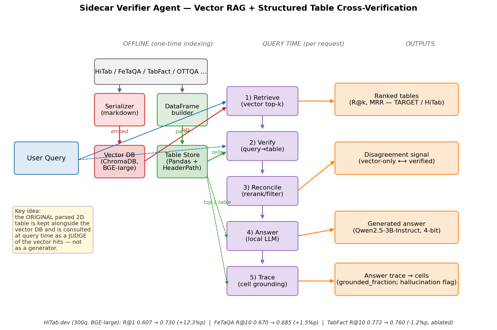

# Sidecar Verifier Agent

Query-aware verifier that runs alongside a vector-RAG retriever for tabular QA. The original parsed 2-D table is kept in a Pandas-backed store **separately** from the vector DB, and is consulted **at query time** as a *judge* of the vector hits (not as a generator).



## Why this architecture?

Closest related work — TableRAG (EMNLP 2025) and TabSQLify (NAACL 2024) — use SQL/structured lookups as part of *answer generation*. We instead use the structured table as a **reranker / verifier** of dense retrieval. Concretely, at query time:

1. **Retrieve** — vector search returns top-k candidate tables (ChromaDB + BGE-large).
2. **Verify** — for each candidate table, check (a) how many query keywords appear in the table's title + header paths, and (b) how many query numbers appear in actual cells. This is a *query→table* check, not chunk→table.
3. **Reconcile** — fuse vector similarity with verification confidence (`fused = 0.8·vector + 0.2·verify`) and re-sort.
4. **Answer** *(optional)* — run a local LLM (Qwen2.5-3B-Instruct, 4-bit) on the top-1 reconciled table.
5. **Trace** — map the answer's numeric spans back to `(row, col)` cells in the original DataFrame. Spans that fail to ground are flagged as hallucinations.

## Layout

```
sidecar_verifier/
├── store/
│   └── table_store.py      Pandas-backed TableStore + header-path index
├── agent/
│   ├── retriever.py        Wrapper around ChromaDB collection
│   ├── verifier.py         Query→table keyword + numeric overlap
│   ├── reconciler.py       rerank / filter / filter+rerank
│   ├── tracer.py           Answer span → (row, col) grounding
│   ├── answerer.py         Local LLM (Qwen2.5-3B-Instruct, bnb 4-bit)
│   └── pipeline.py         End-to-end agent
├── target_adapter.py       TARGET-benchmark adapter (paper-grade compare)
├── demo.py                 Interactive demo
└── eval/
    ├── faithfulness.py     Retrieval eval: 11 configs × HiTab serializers
    ├── answer_accuracy.py  End-to-end LLM answer eval vs gold
    └── target_run.py       TARGET benchmark runner (FeTaQA/TabFact/OTTQA)
```

## Results

### 1. Retrieval reranking on HiTab dev (300 queries, BGE-large-en-v1.5)

| Serializer | vector R@1 | verified R@1 | Δ |
|---|---|---|---|
| plain_markdown | 0.607 | **0.730** | +12.3 pp |
| json_kv | 0.590 | **0.737** | +14.7 pp |
| header_path | 0.763 | **0.783** | +2.0 pp |

Sweet spot is light reranking (`w_verify ≈ 0.1 – 0.2`). Filter-only and combined modes hurt R@5/R@10.

### 2. TARGET benchmark — generalization check

Apples-to-apples comparison on **the same vector index**; the only difference is whether the verifier rerank step runs.

| Dataset | Baseline R@10 (BGE-large) | + Verifier rerank | Δ | TARGET-published best |
|---|---|---|---|---|
| **FeTaQA**  | 0.670 | **0.685** | **+1.5 pp** | stella-en 0.741 |
| **TabFact** | 0.772 | 0.760 | **−1.2 pp** *(ablated)* | row-level 0.848 |
| **HiTab** (not in TARGET) | 0.607 | **0.730** | +12.3 pp | — |

The verifier helps when tables have **hierarchical headers or diverse domains** (HiTab, FeTaQA). It hurts on uniformly-structured corpora (TabFact: Wikipedia infoboxes with shared column names like *year, name, result*) because the query↔header keyword signal lacks discriminative power and query↔cell numeric matches collide across many tables.

### 3. End-to-end answer accuracy (30 queries, Qwen2.5-3B-Instruct 4-bit)

| Method | Retrieval R@1 | Answer Acc |
|---|---|---|
| vector-only | 0.733 | 0.067 |
| verified rerank | **0.800** | 0.067 |
| oracle (gold table) | — | 0.100 |

Verifier improves retrieval, but the **end-to-end bottleneck is the LLM reader**. Qwen 3B handles single-cell lookup but cannot aggregate/condition. Swapping in a 7B+ model or a TabSQLify-style cell-pre-extraction step should unlock the retrieval gains.

## Running the experiments

```bash
# 1. interactive demo (retrieval + optional LLM)
python sidecar_verifier/demo.py --n-queries 5
python sidecar_verifier/demo.py --n-queries 5 --llm                # adds Qwen2.5-3B-Instruct

# 2. retrieval rerank eval on HiTab
python sidecar_verifier/eval/faithfulness.py --max-queries 300 \
    --serializer plain_markdown

# 3. end-to-end answer accuracy (oracle upper bound included)
python sidecar_verifier/eval/answer_accuracy.py --max-queries 30 --also-gold

# 4. TARGET benchmark — paper-grade comparison
python sidecar_verifier/eval/target_run.py --dataset fetaqa --top-k 10
python sidecar_verifier/eval/target_run.py --dataset tabfact --top-k 10
```

`results/` holds the JSON / CSV outputs (`verifier_eval*.json`, `answer_accuracy.json`, `target/*.json`).

## Limitations / next steps

- **TabFact regression** — verifier needs a *domain-strict* mode or column-name TF-IDF weighting before being safe to enable by default.
- **3B reader is too small** for HiTab-style aggregation. Either upgrade the reader (Qwen 7B 4-bit, Groq Llama-3.3-70B free tier, OpenRouter) or insert a SQL-style cell extractor between rerank and answer.
- **Tracer bug** — numeric tracing currently misses some integer/float coercion cases; needs a deeper unit test sweep.
- **OTTQA** not yet evaluated (long indexing). Expected to be the most favourable for the verifier given BM25 already achieves 0.967 there (strong keyword signal).
